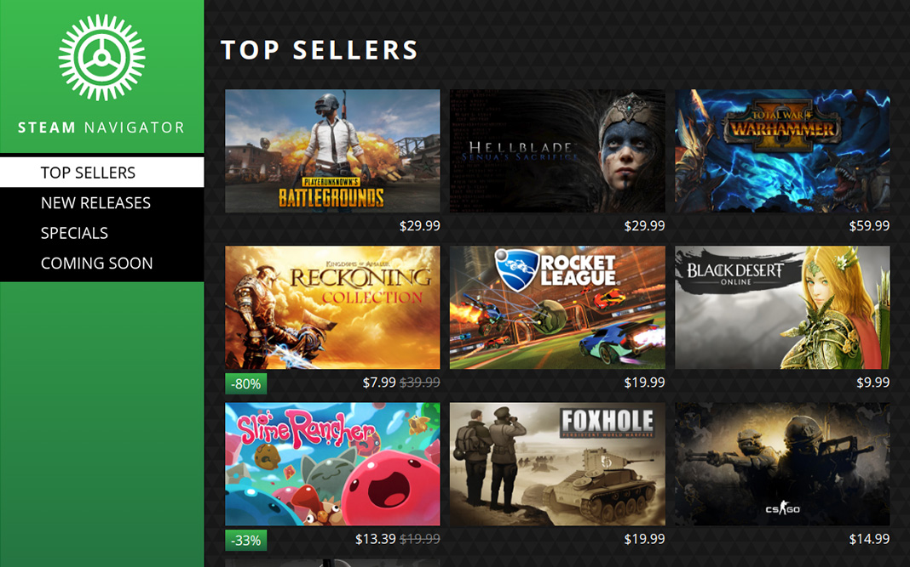

# Steam Navigator

### A front end AngularJS web application for viewing the Steam Store.
Users can explore trending games and new releases, as well as see sales and discounts.

## Demo App
You can see a demo version of the application deployed to Heroku here: https://steam-navigator.herokuapp.com/

## Functionality
It leverages the [Steam Store web API](https://wiki.teamfortress.com/wiki/User:RJackson/StorefrontAPI) and displays top selling games in a responsive interface. Users can view different categories for games with a side navigation and get more information for individual games. Game pages are routed via Steam Store IDs and include parsed HTML descriptions and collections of screenshots.

## Application Info
- [AngularJS](https://angularjs.org/) is used for the front end. It functions as a single-page application.
- The application is configured and built with [Node Package Manager](https://www.npmjs.com/), [Webpack](https://webpack.js.org/), and [Babel](https://babeljs.io/).
- [Node](https://nodejs.org/) and [Express.js](https://expressjs.com/) are used for a simple back end (found in the [server.js](../master/server.js)). It acts as a proxy to make API requests to Steam in order to circumvent [cross-origin](https://developer.mozilla.org/en-US/docs/Web/HTTP/Access_control_CORS) denial.
- Data for games on the front end is acquired via AJAX requests made through a [service](../master/app/services/GamesService.js), invoked via [app.js](../master/app/app.js) resolves before pages are loaded.
- [AngularJS Material](https://material.angularjs.org/latest/) is used for layout and styling.
- A responsive grid system is implemented for games and screenshots via AngularJS Material through a [service](../master/app/services/GridService.js).
- Images are loaded then animated in to prevent loading distortions in the image grids. Game thumbnails and screen shot thumbnails are modified with a [directive](../master/app/directives/ShowOnLoad.js) which triggers a controller scope variable and displays the image when it has loaded via ng-show in the template. That in turn triggers ngAnimate CSS animations to fade the fully loaded component template in.

## Commands

`npm run build` - Use Webpack to build for production.

`npm run start` - Run the Express server via Node.

`npm run dev` - Build for development and run Express server. Code changes will be implemented automatically through hot reloading.

## Install Instructions
Node Package Manager (NPM) is used for dependencies. To install the application locally, follow these instructions:

1. Install [Node.js](https://nodejs.org/). NPM comes packaged with it.
2. Run `npm install` in the command line while in the project directory. It will install dependencies from the [package.json file](../master/package.json).
3. To run the local dev server at http://localhost:5000, run `npm run dev`. It will run the Node/Express application in the [server.js file](../master/server.js) and build the application with Webpack.

The Steam Storefront API is public, so no key is necessary.

## Testing
The test framework uses [Jasmine](https://jasmine.github.io/) and [Karma](https://karma-runner.github.io/) as the test runner.

Tests are found under the [tests folder](../master/tests). Currently the test suite is incomplete.

On Linux, you can install the Karma CLI via the command:
`sudo npm install -g karma-cli`. Then, after NPM dependencies have been installed, run the tests with `karma start`.

## License
This project is open source under the terms of the [MIT License](http://opensource.org/licenses/MIT).
